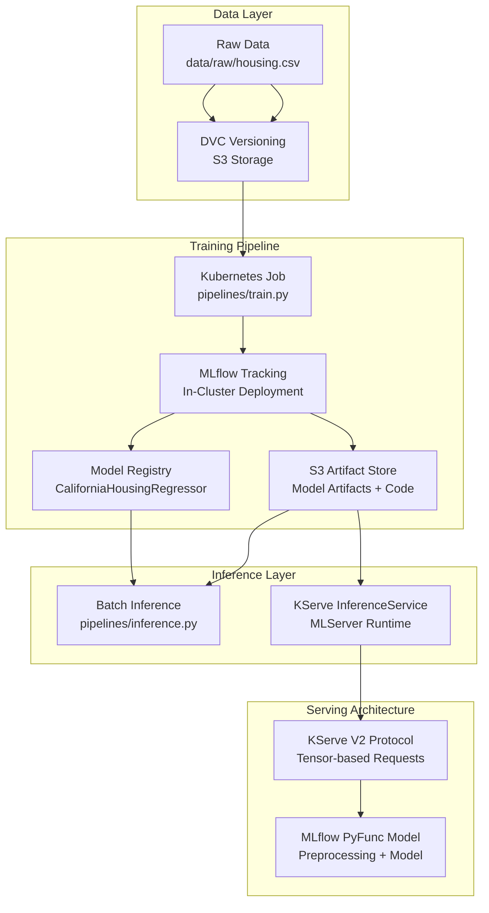

# 🚀 ML from Scratch to Production

<div align="center">

[](https://www.python.org/)
[](https://scikit-learn.org/)
[](https://dvc.org/)
[](https://mlflow.org/)
[](https://fastapi.tiangolo.com/)
[](https://www.docker.com/)
[](https://kubernetes.io/)
[](https://opensource.org/licenses/MIT)

**An end-to-end Machine Learning engineering project that demonstrates how an ML system evolves from experimentation into a production-ready, containerized, and deployable service.**

</div>


## 🎯 Project Overview

This repository demonstrates the **full lifecycle of a Machine Learning system**, from early experimentation to production-oriented deployment.

Using the **California Housing dataset**, the project focuses on **engineering practices**:

- Reproducible training pipelines
- Explicit separation between training and serving
- Model lifecycle management with MLflow
- Batch and online inference workflows
- Docker-first execution
- Kubernetes-ready architecture


## 🌿 Branch Architecture

This repository is structured as a **progressive learning path**, with each branch representing a stage in ML system maturity.

| Branch | Focus | Key Question |
|------|------|-------------|
| `ml-baseline` | ML experimentation | *How do we explore data and choose a model?* |
| `api-baseline` | Serving fundamentals | *How do we expose a trained model?* |
| `main` | Production MLOps | *How does this become reliable and deployable?* |

The `main` branch represents the **final, production-oriented design**.


## 🏗️ System Architecture Overview

The platform implements a Kubernetes-native ML system with:

- **DVC + S3**: Dataset versioning and storage
- **Kubernetes Jobs**: Ephemeral training workloads
- **MLflow (in-cluster)**: Custom image with boto3, psycopg2 dependencies
- **Model Registry**: Alias-based promotion workflows
- **KServe + MLServer**: V2 protocol serving with direct S3 access
- **Separation of concerns**: Control plane (MLflow) vs data plane (S3) vs serving plane (KServe)

### Data Flow

```
DVC (S3) → K8s Training Job → MLflow (K8s) → S3 Artifacts → KServe → V2 Inference
```

1. **DVC** manages dataset versions in S3
2. **Kubernetes Job** pulls data via DVC, executes training
3. **MLflow** (in-cluster) logs experiments and model metadata
4. **S3** stores model artifacts (PyFunc + code + dependencies)
5. **Model Registry** creates version and updates alias
6. **KServe** pulls model from S3 using resolved `storageUri`
7. **MLServer** loads PyFunc model and serves via V2 protocol




## 🚀 Quick Start (Main Branch)

```bash
git clone https://github.com/atkaridarshan04/ml-from-scratch-to-prod.git
cd ml-from-scratch-to-prod
git checkout main
```

### Production Deployment

➡️ See: [docs/k8s.md](./docs/k8s.md)


## 🗂️ Project Structure (Main)

```
ml-from-scratch-to-prod/
├── .dvc/                 # DVC configuration
├── data/                 # Raw data and inference inputs
├── docs/                 # Architecture, workflows, and decisions
├── k8s/                  # Kubernetes manifests
├── pipelines/            # Training & batch inference entry points
├── src/                  # Core ML logic
├── scripts/              # Scripts
├── requirements.txt      # Dependencies
├── Dockerfile.mlflow     # Custome MLFlow Docker image
├── Dockerfile.train      # Training Job Docker image
└── README.md             # This file
```


# 📚 Documentation Hub

| **Topic** | **Document** |
|-----------|-------------|
| Data versioning | [dvc.md](./docs/dvc.md) |
| MLflow architecture | [mlflow.md](./docs/mlflow.md) |
| Model packaging | [model-packaging.md](./docs/codebase/model-packaging.md) |
| Training workflow | [training.md](./docs/workflows/training.md) |
| Batch inference | [inference-batch.md](./docs/workflows/inference-batch.md) |
| Online inference | [inference-online.md](./docs/workflows/inference-online.md) |
| Kubernetes deployment | [k8s.md](./docs/k8s.md) |


## 📄 License

This project is licensed under the MIT License.
See the [LICENSE](LICENSE) file for details.

---