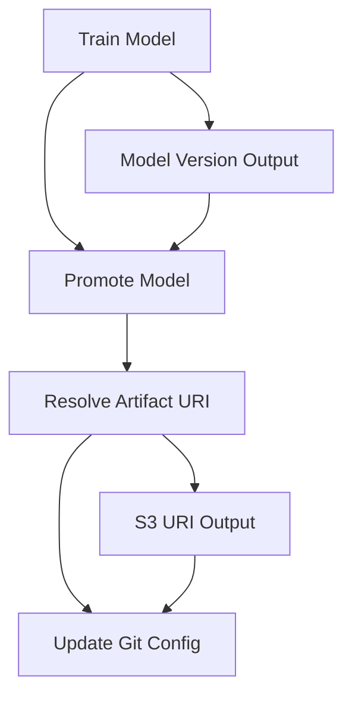
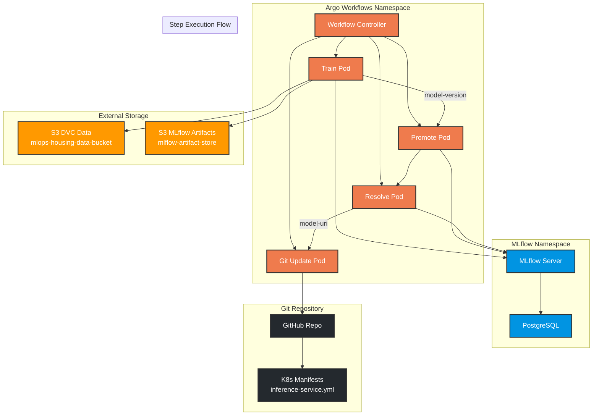
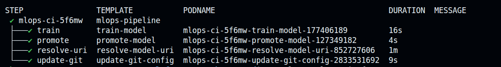
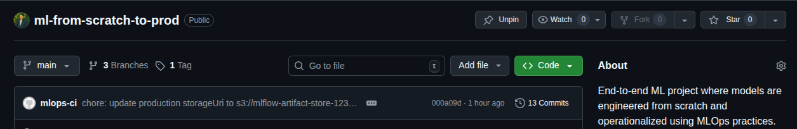

# ⚡ Argo Workflows for MLOps CI

This document describes the CI automation pipeline implemented using Argo Workflows for this project.

The workflow automates:

- model training
- MLflow model registration
- production alias promotion
- model artifact resolution
- Git-based deployment configuration update

> This implementation demonstrates **production-grade CI automation** for ML model lifecycle management.

## 🧩 Architecture Overview

### Workflow Components

The MLOps pipeline consists of **4 sequential steps** with parameter passing:



### Component Interaction Diagram




### Key Design Principles

- **Kubernetes-native**: Runs entirely within cluster
- **GitOps-driven**: All changes committed to Git
- **Artifact lineage**: Complete traceability from data to deployment
- **Idempotent**: Safe to re-run at any stage
- **Parameterized**: Configurable model names and versions

## 📋 Prerequisites

### 1. Kubernetes Cluster Requirements

**Verify cluster access:**
```bash
kubectl cluster-info
kubectl get nodes
```

### 2. Argo Workflows Installation

**Install Argo Workflows:**
```bash
kubectl create namespace argo
kubectl apply -n argo -f https://github.com/argoproj/argo-workflows/releases/latest/download/install.yaml
```

Also make sure u have the Argo CLI installed.

**Verify installation:**
```bash
kubectl get pods -n argo
argo version
```

### 3. MLflow Infrastructure

**Required components:**
- MLflow server (in-cluster)
- PostgreSQL backend store
- S3 artifact store

**Verify MLflow:**
```bash
kubectl get pods -n mlflow
kubectl port-forward svc/mlflow 5000:5000 -n mlflow
curl http://localhost:5000/health
```

**Reference:** [`k8s.md`](./k8s.md)

### 4. S3 Storage Configuration

**Required buckets:**
- DVC data storage: `mlops-housing-data-bucket`
- MLflow artifacts: `mlflow-artifact-store-123-da`

**ServiceAccount with S3 permissions:**
```bash
kubectl apply -f k8s/security/s3-auth.yml
```

**Reference:** [`dvc.md`](./dvc.md) & [`k8s.md`](./k8s.md)

### 5. GitHub Integration

**Create GitHub token:**
- Repository: `Contents: Write` permission
- Generate at: https://github.com/settings/tokens

**Create Kubernetes secret:**
```bash
kubectl apply -f k8s/security/github-auth.yml
```

### 6. RBAC Configuration
To authorize the workflow to orchestrate pods and manage task results within the cluster, apply the following: 

```bash
kubectl apply -f k8s/security/rbac.yml
```
> Note: This binds the necessary permissions to the s3-sa ServiceAccount, following the principle of least privilege.


## 🚀 Workflow Details

### Workflow Structure

The workflow is defined in [`argo/workflow.yml`](../argo/workflow.yml) with the following structure:

```yaml
apiVersion: argoproj.io/v1alpha1
kind: Workflow
metadata:
  generateName: mlops-ci-
spec:
  entrypoint: mlops-pipeline
  serviceAccountName: s3-sa
  arguments:
    parameters:
      - name: model-name
        value: CaliforniaHousingRegressor
```


### Step 1: Model Training

**Purpose:** Execute ML training pipeline and register model

**Container:** `ghcr.io/atkaridarshan04/ml-trainer:v1.0.0`

**Key operations:**
1. Clone repository
2. Configure DVC remote
3. Pull dataset via `dvc pull`
4. Execute `python -m pipelines.train`
5. Query MLflow for latest model version
6. Output model version for next step

**Environment variables:**
- `MLFLOW_TRACKING_URI`: MLflow server endpoint
- `DATA_URI`: Dataset path
- S3 credentials via `secretRef`

**Output parameter:**
```yaml
outputs:
  parameters:
    - name: model-version
      valueFrom:
        path: /tmp/model_version.txt
```

### Step 2: Model Promotion

**Purpose:** Update MLflow model alias to production

**Container:** `ghcr.io/atkaridarshan04/mlflow-server:v3.8.0`

**Input parameter:**
```yaml
inputs:
  parameters:
    - name: model-version
```

**Key operations:**
1. Parse model version from previous step
2. Connect to MLflow client
3. Set `production` alias to latest version
4. Validate promotion success

**Critical fix:** String trimming to handle whitespace in version numbers

### Step 3: Artifact URI Resolution

**Purpose:** Resolve MLflow alias to physical S3 path

**Container:** `python:3.10`

**Key operations:**
1. Install MLflow client
2. Query model version by `production` alias
3. Resolve download URI to S3 path
4. Output URI for deployment update

**Output parameter:**
```yaml
outputs:
  parameters:
    - name: model-uri
      valueFrom:
        path: /tmp/model_uri.txt
```

### Step 4: Git Configuration Update

**Purpose:** Update Kubernetes manifest with new model URI

**Container:** `alpine/git`

**Input parameter:**
```yaml
inputs:
  parameters:
    - name: model-uri
```

**Key operations:**
1. Clone repository with GitHub token
2. Update `k8s/workloads/inference-service.yml`
3. Replace `storageUri` with resolved S3 path
4. Commit and push changes

**GitOps pattern:** All deployment changes via Git commits

## 🎯 Execution Guide

### Submit Workflow

**Basic submission:**
```bash
argo submit argo/workflow.yml --watch
```

**With custom parameters:**
```bash
argo submit argo/workflow.yml \
  --parameter model-name=CustomModel \
  --watch
```

### Monitor Execution

**List workflows:**
```bash
argo list
```

**Get workflow details:**
```bash
argo get <workflow-name>
```




**View step logs:**
```bash
argo logs <workflow-name>
argo logs <workflow-name> -c train-model
```

**Follow live logs:**
```bash
argo logs <workflow-name> --follow
```

### Workflow Status

**Successful execution indicators:**
- All steps show `✓` status
- MLflow shows new model version
- Git repository updated with new `storageUri`
- No error logs in any step

**Common failure points:**
- S3 permissions
- MLflow connectivity
- GitHub token expiration
- Container image pull failures

---