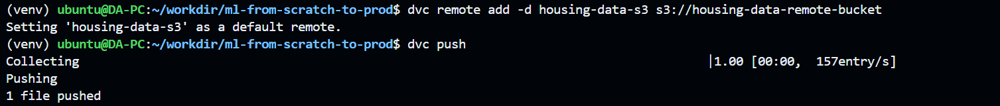
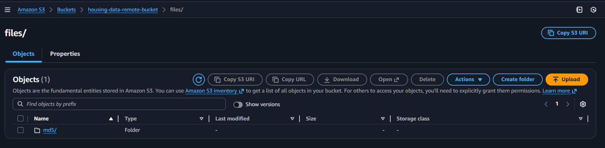
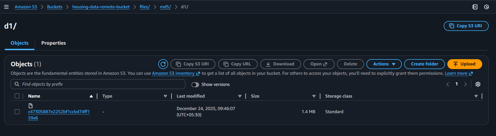
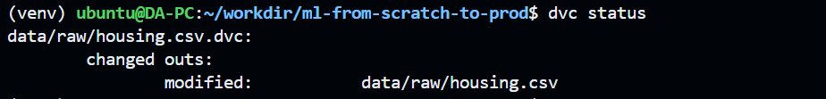

# 📦 Data Version Control (DVC)

This project uses **DVC (Data Version Control)** to manage and version the
**raw dataset** used for training and inference.

DVC enables reproducibility by ensuring that every Git commit is associated
with an **exact version of the data** used at that point in time.

## 🧠 Data Versioning Strategy

This project follows a **minimal and intentional DVC strategy**.

### ✅ Tracked with DVC
Raw dataset used for all experiments and pipelines:
```
data/raw/housing.csv
```

All non-raw data (splits, features, artifacts) is **deterministically generated by pipelines**.

## ⚙️ How to Use DVC

### 1️⃣ Initialize DVC

Run once from the project root:

```bash
dvc init
```

This creates:

* `.dvc/`
* `.dvcignore`

---

### 2️⃣ Track the Raw Dataset

```bash
dvc add data/raw/housing.csv
```

This creates: [data/raw/housing.csv.dvc](../data/raw/housing.csv.dvc)

---

### 3️⃣ Configure Remote Storage

DVC stores data outside Git using a remote backend.

Example (local filesystem remote):

```bash
mkdir -p ~/dvc-storage
dvc remote add -d localstorage ~/dvc-storage
```

```bash
dvc remote add -d housing-data-s3 s3://housing-data-remote-bucket
```

Commit all generated files:

```bash
git add .dvc .dvcignore data/raw/housing.csv.dvc .gitignore
git commit -m "data: initialize DVC and track raw housing dataset with DVC"
```

Push data to remote storage:

```bash
dvc push
```
> Note: Make sure to configure the aws CLI with appropriate credentials if using S3.




<!--  -->


## 🔁 Updating the Dataset

Whenever the raw dataset changes:

```bash
# Modify data/raw/housing.csv
dvc status
```


Then run:

```bash
dvc add data/raw/housing.csv
git commit -m "data: update raw housing dataset"
dvc push
```

Each Git commit now points to a **specific dataset version**.


## 🔄 Reproducing Past Experiments

To reproduce results from an older commit:

```bash
git checkout <commit-hash>
dvc pull
python -m pipelines.train
```

This guarantees:

* Correct code version
* Correct dataset version


## 📌 Summary

* DVC tracks **only the raw dataset**
* Dataset versions are tied to Git commits
* Pipelines generate all derived artifacts
* This approach keeps data lineage clean, reproducible, and scalable

---
