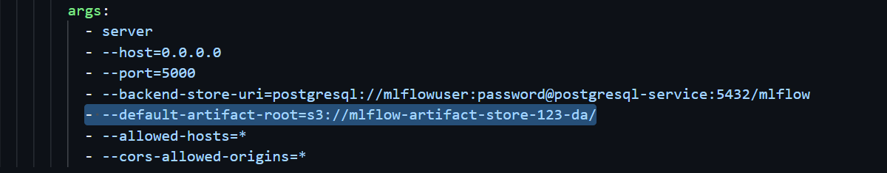
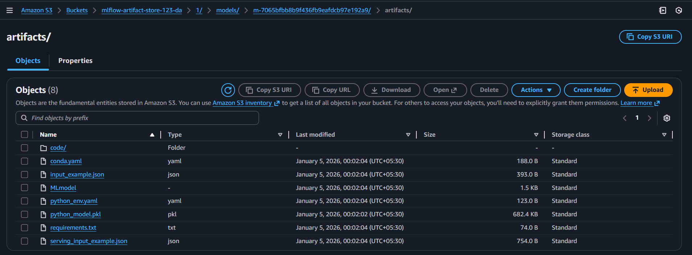
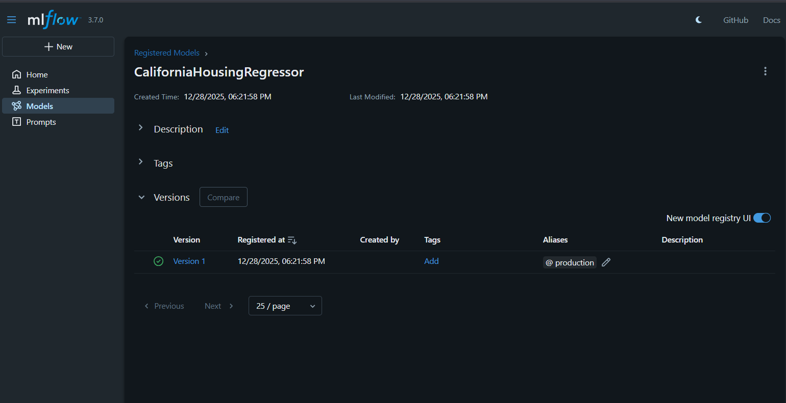
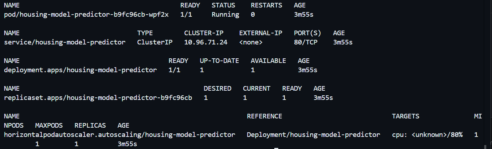

# ☸️ Kubernetes End-to-End ML Serving with MLflow & KServe

This document describes the **exact end-to-end workflow** used to train, register, and serve a machine learning model on Kubernetes using:

* **DVC** for dataset versioning (S3-backed)
* **MLflow** for experiment tracking and model registry
* **Kubernetes Jobs** for training
* **KServe + MLServer** for online inference

> This setup reflects a **realistic production-style architecture**, executed step by step for clarity and validation.


## 🧩 Prerequisites

Before starting, ensure:

* A working Kubernetes cluster
* `kubectl` configured
* `helm` installed
* An S3 bucket available for:

  * DVC data storage
  * MLflow model artifacts


## 1️⃣ Dataset Management (DVC)

This workflow assumes the dataset is already tracked and pushed to `s3` using DVC.

Refer to:
👉 [`dvc.md`](./dvc.md)

At the end of this step:

* Dataset exists in **S3**
* `.dvc` file is committed to Git
* Kubernetes jobs can fetch the exact dataset version using `dvc pull`


## 2️⃣ Deploy MLflow on Kubernetes

### Architecture

* **Backend Store**: PostgreSQL (in-cluster, temporary)
* **Artifact Store**: S3
* **Deployment**: Custom MLflow image (includes `boto3`, `psycopg2`)
* **Access**: ClusterIP + port-forward

---

### 2.1 Create Namespace

```bash
kubectl create namespace mlflow
```

---

### 2.2 Deploy PostgreSQL (Backend Store)

```bash
kubectl apply -f k8s/mlflow/postgres.yml
```

---

### 2.3 Configure Service Account (S3 Access)

```bash
kubectl apply -f k8s/security/s3-auth.yml -n mlflow
```

This service account provides:

* S3 credentials (static for now)
  > Make sure it have read/write permissions to the S3
* Will later be replaced by IRSA / workload identity

---

### 2.4 Deploy MLflow Server

Ensure the artifact root points to S3 in [k8s/mlflow/mlflow.yml](../k8s/mlflow/mlflow.yml): 

```yaml
args:
  - --default-artifact-root=s3://mlflow-artifact-store-123-da/
```



Apply:

```bash
kubectl apply -f k8s/mlflow/mlflow.yml -n mlflow
```

Verify:

```bash
kubectl get all -n mlflow
```

---

### 2.5 Access MLflow UI

```bash
kubectl port-forward svc/mlflow 5000:5000 -n mlflow
```

Open:
👉 [http://localhost:5000](http://localhost:5000)


## 3️⃣ Training & Model Deployment Options

You can execute training and model deployment through **two approaches**:

### 🤖 Automated Approach (Recommended)

Use **Argo Workflows** for complete CI/CD automation:

👉 **See:** [`argo-workflow.md`](./argo-workflow.md)

This handles:
- Training execution
- Model registration  
- Production alias promotion
- Artifact URI resolution
- Git manifest updates

**Quick start:**
```bash
argo submit argo/workflow.yml --watch
```

---

### 🔧 Manual Approach

For step-by-step execution and learning, follow the manual process below.

### 3.1 Run Training as a Kubernetes Job

Training is executed as a **Kubernetes Job**

### 3.1 Apply K8s Service Account

```bash
kubectl apply -f k8s/security/s3-auth.yml
```

### 3.2 Launch Training Job

```bash
kubectl apply -f k8s/workload/training-job.yml
```

This job will:

* Clone the Git repository
* Pull dataset via `dvc pull`
* Run `train.py`
* Log experiments to MLflow
* Upload artifacts to S3
* Register a new model version

---

### 3.3 Validate Training Output

In MLflow UI:

* A new experiment appears
* A new run is logged
* Model artifacts exist in S3



---

### 3.4 Assign Production Alias

In **MLflow → Models**:

* Select the registered model version
* Assign alias: `production`



> Alias management is **manual for now**.
> CI/CD automation will be added later.


## 4️⃣ Resolve Model Artifact URI (Manual Only)

> **Note:** This step is **only required for manual approach**. 
> Automated workflow handles this automatically.

KServe **cannot consume MLflow aliases directly**.

Therefore, the alias must be **resolved to a physical S3 path**.

---

### 4.1 Resolve Production Model URI

On your local machine:

```bash
export MLFLOW_TRACKING_URI=http://localhost:5000
```

Run:

```bash
python scripts/resolve_model_artifact_uri.py
```

Output example:

```
s3://mlflow-artifact-store-123-da/1/models/m-7065bfbb8b9f436fb9eafdcb97e192a9/artifacts/
```

This is the **exact path** KServe will load.

#### OR
> Copy directly form the s3


## 5️⃣ Install KServe

KServe is used for **online inference**.


### 5.1 Install Cert-Manager

```bash
kubectl apply -f https://github.com/cert-manager/cert-manager/releases/latest/download/cert-manager.yaml
```

Verify:

```bash
kubectl get pods -n cert-manager
```

---

### 5.2 Install KServe CRDs

```bash
kubectl create namespace kserve

helm install kserve-crd oci://ghcr.io/kserve/charts/kserve-crd \
  --version v0.16.0 \
  -n kserve \
  --wait
```

---

### 5.3 Install KServe Controller

```bash
helm install kserve oci://ghcr.io/kserve/charts/kserve \
  --version v0.16.0 \
  -n kserve \
  --set kserve.controller.deploymentMode=RawDeployment \
  --wait
```

Verify:

```bash
kubectl get pods -n kserve
```


## 6️⃣ Deploy Model with KServe

### 6.1 Update InferenceService

Edit [k8s/workloads/inference-service.yml](../k8s/workloads/inference-service.yml) accordingly:

```yaml
spec:
  predictor:
    model:
      storageUri: "s3://mlflow-artifact-store-123-da/1/models/m-7065bfbb8b9f436fb9eafdcb97e192a9/artifacts/"
```

> Note: If using the automated Argo workflow, this step is handled automatically.

Apply:

```bash
kubectl apply -f k8s/workloads/inference-service.yml
```

---

### 6.2 Verify Deployment

```bash
kubectl get all
```



Check readiness:

```bash
kubectl get inferenceservice housing-model
```

Wait until:

```
READY=True
```


## 7️⃣ Access the Model (Online Inference)

### 7.1 Port-Forward

```bash
kubectl port-forward svc/housing-model-predictor 8000:80
```

---

### 7.2 Test Inference (v2 Protocol)

```bash
curl -X POST http://127.0.0.1:8000/v2/models/housing-model/infer \
  -H "Content-Type: application/json" \
  -d '{
    "inputs": [
      { "name": "longitude", "shape": [1], "datatype": "FP64", "data": [-122.23] },
      { "name": "latitude", "shape": [1], "datatype": "FP64", "data": [37.88] },
      { "name": "housing_median_age", "shape": [1], "datatype": "FP64", "data": [41] },
      { "name": "total_rooms", "shape": [1], "datatype": "FP64", "data": [880] },
      { "name": "total_bedrooms", "shape": [1], "datatype": "FP64", "data": [129] },
      { "name": "population", "shape": [1], "datatype": "FP64", "data": [322] },
      { "name": "households", "shape": [1], "datatype": "FP64", "data": [126] },
      { "name": "median_income", "shape": [1], "datatype": "FP64", "data": [8.3252] },
      { "name": "ocean_proximity", "shape": [1], "datatype": "BYTES", "data": ["NEAR BAY"] }
    ]
  }'
```

---
